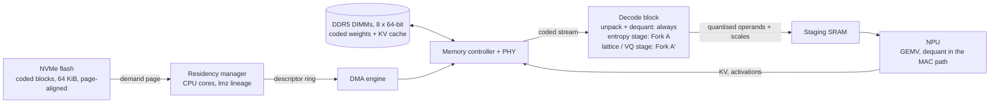
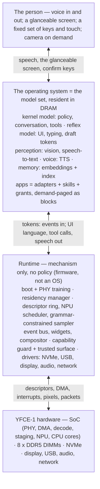
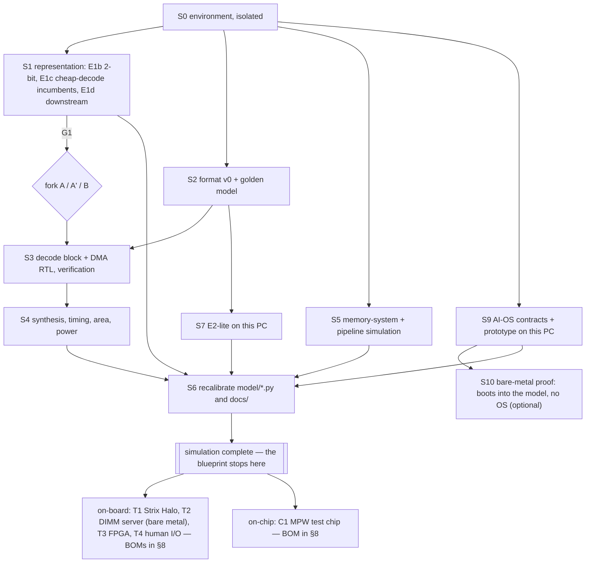

# Blueprint

The whole project as one plan: what the machine is, how it decomposes, the
contracts between its parts, the decisions still open and the order they get
closed in. It is detailed **up to and including the simulation campaign**,
which is sized to run on the PC this repository lives on. Everything after
that — a board, an FPGA, a test chip — is listed as a bill of materials and a
next-plan, not designed.

Written 2026-08-16 against the state in `decisions.md`: E1 answered "no at
4-bit", the decode block is currently unjustified, and the honest next move
is to prove the system in software. The blueprint takes that seriously
rather than working around it — see §6, where the design forks depending on
what the representation campaign returns. Revised 2026-08-17 to add the
**AI PC** (§3): the same apparatus with human I/O and no operating system —
the model is the OS, and the appliance loses Linux with it — and, later the
same day, to make it voice-first with a fixed touch/key set and models in
charge of apps and settings (`os/`). Revised again after NVIDIA disclosed
**RTX Spark**, and then re-footed: §1 no longer treats that as an event but as
the first arrival on a commodity curve, which is a different plan. The
hardware envelope is assumed to commoditise; **Fork C — the stack on hosts
somebody else builds — is the base case**, and silicon is an option this
document defers rather than a destination it works toward. **YFCE-M**, the
portable variant on socketed LPDDR5X modules, is described the same way: a
target envelope, not a committed board.

    docs/simulation.md   the PC-side campaign, stage by stage (S0–S10)
    docs/architecture.md the design and its invariant — this document assumes it
    docs/decisions.md    what is settled; §5 below proposes additions to it

## 1. The machine

One machine whose one job is batch-1 decoding of a large model that stays
resident, in three variants that share a runtime, a format and an SoC family.
Read them as **target envelopes first and boards second**: each says what the
software should assume about memory, and each can be met either by hardware
somebody else sells (the base case, §6 Fork C) or by building it (an option,
gated).
**YFCE-1** is the headless appliance: mains-powered, socketed DDR5, serves
models over the network. **YFCE-P** is the AI PC: the same board with a
microphone array, speakers, a glanceable touch display and a camera —
keyboard optional — operated by voice, with a model as its operating system
(§3; the OS's own directory is `os/`). **YFCE-M** is the portable one: the
same design on socketed LPDDR5X modules instead of DIMMs, battery-powered
(below). None of the three runs Linux.

| | reference | why |
|---|---|---|
| Memory | 8 × 64-bit DDR5-5600 DIMM, 128 GB (12 × 64-bit / 192 GB is the family's wide end) | width buys bandwidth; sockets buy capacity per dollar |
| Bandwidth | 358 GB/s peak, **~301 GB/s achieved** at 0.84 | `model/system.py`, to be measured in S5 |
| SoC | 28 nm-class; DDR5 PHY + controller, DMA/descriptor engine, decode block, staging SRAM, NPU, CPU cores; YFCE-P adds display, USB 3, multi-channel audio with an always-on wake/AEC path, secure boot | the PHY is the hard part; nothing else needs a leading node |
| NPU | ~20 TOPS int8 (bom.py: 15 mm²) for YFCE-1; 60–100 TOPS for YFCE-P (§3, S8) | decode needs ~0.6 TMAC/s; the rest is prefill, which the AI PC makes central |
| Storage | NVMe, PCIe 4 ×4, coded model archives | flash → DRAM hop is where software compression already pays |
| Board | ~14–16 layers, ~1,700-ball FCBGA, 8 DIMM slots, ~150 W PSU; YFCE-P adds DP/HDMI, USB, mic array, speaker amp, confirm keys and a hardware mute switch, Wi-Fi | `model/bom.py` |
| Software | one bare-metal runtime (mechanism only) + residency manager (lmz lineage) + the resident model set; no OS | §3 |

What it delivers, if the models hold (real bandwidth ÷ bytes per token):

| model | YFCE-1, 8ch DDR5-5600 (301 GB/s) | 12ch DDR5-5600 (452) | YFCE-M, 4× LPCAMM2-8533 (459) | Strix Halo (215 measured) |
|---|---|---|---|---|
| 8B at Q4_K_M (4.5 GB) | 67 tok/s | 100 | 102 | 48 |
| 70B at Q4_K_M (39.4 GB) | 7.6 | 11.5 | 12 | 5.5 |
| 70B int8 (70 GB) | 4.3 | 6.5 | 6.6 | 3.1 |
| 120B-A5B MoE at 4.5 bpw (67 GB resident, 2.8 GB active) | 107 | 161 | 164 | 76 |
| 235B-A22B MoE at 4.5 bpw (132 GB resident) | needs the 192 GB build | 37 | 37 (256 GB build) | does not fit |
| 405B at 2.5 bpw (127 GB — capacity, not speed) | 2.4 | 3.6 | 3.6 | does not fit |

All four columns are bandwidth ÷ bytes per token, and every one of them is
also roughly what an RTX Spark does at 128 GB — see below.

The machine is *not* a prefill engine, not a training box, and not a phone.
Time-to-first-token on long inputs will be visibly worse than a leading-edge
SoC and the positioning has to say so; §3 says what the AI PC does about it.

### The envelope is a commodity — what that leaves

NVIDIA disclosed **RTX Spark** (N1X) this month: 20 Grace ARM cores and a
6,144-core Blackwell GPU on TSMC 3 nm, up to 128 GB of soldered unified
LPDDR5X at **~300 GB/s**, ~1 PFLOP of AI compute, in laptops *and* desktops
from ASUS, Dell, HP, Lenovo, Microsoft Surface and MSI this autumn, at
**~$2,899** for flagship systems. DGX Spark, the earlier workstation, now
starts at $4,699 after the memory-price rise.

Peak is what a vendor quotes; **achieved** is peak × 0.84, the derating
`model/system.py` applies to everything including its own configurations,
because treating peak as achievable is how these comparisons usually go
wrong. Only Strix Halo's number is measured.

| system | node | bus | memory | peak | achieved | 8B Q4 | 120B-A5B | AI compute | price |
|---|---|---|---|---|---|---|---|---|---|
| RTX Spark N1X | N3 | 256-bit | 128 GB LPDDR5X-9600, soldered | ~300–307 | ~252–258 | 57 | 92 | ~1 PFLOP | ~$2,899 |
| DGX Spark GB10 | N3 | 256-bit | 128 GB LPDDR5X, soldered | 273 | 229 | 51 | 82 | ~1 PFLOP | $4,699 |
| Strix Halo | N4 | 256-bit | 128 GB LPDDR5X-8000, soldered | 256 | **215 measured** | 48 | 77 | ~50 TOPS | $1,500–2,600 |
| M4 Max | N3E | 512-bit | 128 GB LPDDR5X-8533, soldered | 546 | 459 | 102 | 164 | ~38 TOPS NPU | in a $4k laptop |
| **YFCE-1** | 28 nm | 512-bit | 128 GB DDR5-5600, **DIMMs** | 358 | 301 | 67 | 107 | ~20 TOPS | BOM $462–1,422 |
| **YFCE-M** | 28 nm / 16 nm? | 512-bit | 256 GB LPDDR5X-8533, **LPCAMM2** | 546 | 459 | 102 | 164 | ~20 TOPS | BOM ~$2,010 |

**The premise implies its own commoditisation, and this document was slow to
say so.** If bandwidth is bought with pins rather than lithography — and a
3 nm part choosing 256 bits is evidence that it is — then nobody holds a
position on bandwidth, *this project included*. Spark is not an event that
took the envelope away. It is the first arrival on a curve that was always
going to arrive, and the curve is the thing to plan against.

**The curve.** Strix Halo in 2025: 256-bit, 215 GB/s measured, $1,500–2,600.
DGX Spark: 273 GB/s at $4,699. RTX Spark now: ~300 GB/s at ~$2,899, in
laptops and desktops, from six OEMs. Behind them, LPCAMM2 is putting wide
LPDDR into upgradeable modules across the whole PC industry — Intel has
demoed Panther Lake at 9600 MT/s — Apple has shipped 512 bits since 2023, and
AMD, Qualcomm and MediaTek all have to answer Spark. The DRAM spike is
cyclical and will unwind. **128 GB at 300+ GB/s for $1,000–1,500 by 2028 is a
conservative reading of that list, not a bold one.**

**Which closes the silicon question on arithmetic, before any gate does.**
`model/bom.py` budgets ~40 engineers for 2.5 years. Add the campaign
(4–7 months), a test chip (6–9 months), bring-up and one respin: **parts in
2029–2030.** That is a program racing a cost curve which arrives first, and
the machine is mostly DRAM either way, so the mature-node die saving — $5
against maybe $150 — shrinks to a rounding error exactly as the envelope
commoditises. The chip does not lose to Spark. It loses to the calendar.
This is a fourth reason, independent of G1, G2 and G5, and it is the
cleanest of the four.

**What is perishable, and what is not.** The distinction the rest of this
document now hangs on:

| | | |
|---|---|---|
| **perishable** | bandwidth | anyone can buy pins; that is the premise |
| | capacity | density and module counts follow, one generation behind |
| | the mature-node die saving | a rounding error on a machine that is mostly DRAM, and it shrinks as hosts get cheaper |
| | width past 256 bits, capacity past 128 GB | the same commodity, one generation later — these were offered here as durable advantages two revisions ago, and they are not |
| **durable** | **residency** — one representation from flash to DRAM to the MAC units, page-granular, no conversion anywhere | a property of software, so it runs on anyone's hardware, and it gets *cheaper to deliver* as hosts get cheaper |
| | **the operating system** (`os/`) | no hardware roadmap produces it |

**Read the roofline again with that in mind.** `tokens/s = bandwidth ÷ bytes
per token`. Commoditisation hands the numerator to everyone. The denominator
is the half this project owns — and E1 measured its headroom at 4.5% against
`Q4_K_M`, which is not a moat either. So what the format is worth is **not
ratio, it is residency**: cold start, model and expert swap, resident
footprint, and no conversion between the bytes on flash and the bytes the
matrix units consume. That is G4, measured in S7, and it moves from a
supporting experiment to the load-bearing one.

**Cheap hosts are the enabling condition, not the threat.** Every $1,200
128 GB box that ships is a machine this stack can run on and did not have to
build, fund or sell. A software layer that needs cheap wide memory to exist
at all should want that hardware to get free as fast as possible, and should
be indifferent to whose badge is on it.

**The honest weakness in that position.** If the value moves to the OS layer,
so does the competition — and it is Microsoft, Apple and Google, who ship
*with* the hardware and own the defaults. That is a harder fight than
competing on $/GB/s, not an easier one. `os/`'s answer is structural: a
model-as-OS with no legacy surface is the thing they cannot ship, because
their franchise *is* the legacy surface. It is a real argument and an
unproven one, and G6 is where it gets tested rather than asserted.

**And what being unbuilt is worth.** None of this costs anything but document
edits, because nothing is sunk: no mask set, no board, no RTL, no inventory,
no customer. That is not consolation, it is the asset — and the LPCAMM2
reversal on this page is the demonstration. An entire memory-system decision
inverted, and the blast radius was one table, one entry in `decisions.md`,
four rows in `system.py` and two in `bom.py`. The runtime, the format, the
residency manager, the descriptor ring and the AI OS did not notice, because
the memory module sits behind I5 and the rest was written not to care what it
is. The same discipline is what lets the *whole chip* become optional without
the plan collapsing: §6 now reads with **Fork C as the base case**, and the
silicon forks as options that need a market condition none of them currently
has.

### YFCE-M — the portable variant

"Mains-powered appliance" was a premise, not a requirement, and dropping it
changes exactly one component: the memory modules. **LPCAMM2** is LPDDR5X on
a socketed, compression-attached 128-bit module — 120 GB/s each at
LPDDR5X-7500, up to 8533 at 1.05 V, with 9600 shown by Samsung and Lenovo at
96 GB and mass production expected 2027. Two modules is the shipping
configuration (Crucial sells 32 and 64 GB modules at retail today); **four
modules — 512 bits, 256 GB, 459 GB/s — is not shipping anywhere and is a
signal-integrity question, not a purchase.**

| configuration | bus | achieved | capacity now | 2027 | status |
|---|---|---|---|---|---|
| 2× LPCAMM2-7500 | 256-bit | 202 GB/s | 128 GB | 192 GB | shipping parts, proven topology |
| 2× LPCAMM2-8533 | 256-bit | 229 | 128 GB | 192 GB | shipping parts |
| **4× LPCAMM2-8533** | 512-bit | **459** | **256 GB** | 384 GB | unproven at four modules |
| 4× LPCAMM2-9600 | 512-bit | 516 | 256 GB | 384 GB | modules in MP ~2027 |

**What it buys.** Active memory power drops ~58% and standby ~80% against
DDR5 SODIMM, and rather more against eight DIMMs. On the usual assumption of
~12 pJ/bit for a terminated DDR5 DIMM bus and ~5 for LPDDR5X, an 8B model at
Q4 costs **432 mJ per token on DIMMs and 180 mJ on LPCAMM2** — 29 W against
12 W of DRAM traffic at 67 tok/s. A 99 Wh battery (the airline limit) is then
about **4 hours generating at 25 W and 12 hours listening at 8 W**, and a
voice-first machine spends almost all of its life listening, which is exactly
where LPDDR's 80% standby saving lands. The board also shrinks: LPCAMM2 uses
~60% less area than SODIMM and needs no DIMM stub allowance, so the 14–16
layer motherboard becomes a portable's mainboard.

**What it costs.**

- **The node question gets worse, not better.** No 28 nm LPDDR5X-8533 PHY is
  known to exist — `system.py` already flags anything above LPDDR4X-4266 as
  not-mature-node. A portable probably buys a 16/12 nm program: the die is
  still trivial (~$15–20 against $5), but the mask set roughly triples and
  NRE goes from ~$40M toward ~$48M, moving the crossover from ~87k units to
  ~103k at pre-spike DRAM. This is E3/G2 (§6) with a heavier weight on it.
- **The $/GB argument that justified DIMMs does not survive.** It was
  3× — and at August 2026 retail it has *inverted*: LPCAMM2 at $8.26/GB
  (Crucial 64 GB, $7.06 at launch) against DDR5 UDIMM at $12–18.50/GB. On the
  pre-spike basis the DIMM still wins by 2.8×; on today's it loses. Both
  numbers are in `model/system.py`, on one basis, with the date attached, and
  `decisions.md` now carries the reversal.
- **Prefill on a battery.** §3's answer to prefill is either a bigger NPU or a
  MoE kernel; on a portable the bigger NPU also costs watts, which makes the
  MoE kernel the answer rather than an option.

**What it does not change.** The runtime, the format, the residency manager,
the AI OS, the decode-block question (still Fork B unless G1 passes), the
descriptor ring, and the invariant. YFCE-M is a memory-module choice and a
power budget, not a different machine — which is the point of having written
the design down as three layers with contracts between them.

## 2. System decomposition

Modules, what each one produces, and where it stands:

| # | module | artefact | state |
|---|---|---|---|
| M1 | **Representation & format** — the bytes on flash = in DRAM = into the decoder | format spec v0, reference encoder/decoder (golden model) | E1 done at 4-bit; format unspecified beyond lmz's block structure |
| M2 | **Encoder toolchain** — BF16 checkpoint → YFCE archive | `yfce encode`, from lmz | lmz exists; the lossy half does not |
| M3 | **Residency manager** — page-granular demand paging, expert/adapter swap, descriptor issue | part of the runtime | lmz mount/MappedArchive exist; no ring, no driver |
| M4 | **DMA / descriptor engine** — ring → DRAM reads → decoder slots | RTL | none |
| M5 | **Decode block** — unpack/dequant always; entropy and lattice stages conditional | RTL + PPA | estimate only (`model/decoder.py`) |
| M6 | **Staging SRAM + NPU interface** — operand tiles to the MAC array | RTL, sizing | 16 MB assumed in bom.py, unsized |
| M7 | **NPU** — GEMV at bus rate, prefill and encoders | licensed or designed | not started; TOPS is not its figure of merit for decode, and is for prefill |
| M8 | **Memory controller + PHY** — 8–12 × 64-bit DDR5 | licensed IP | E3: licensability at 28 nm unknown |
| M9 | **CPU cores, fabric, IO** — run the runtime; NVMe, network; YFCE-P: display, USB 3, audio, camera | licensed IP | bom.py "misc" |
| M10 | **Board** — 512/768-bit DIMM routing, power, thermal; YFCE-P: human I/O connectors | schematics, layout | none |
| M11 | **Runtime** — bare-metal mechanism: boot, drivers, residency, NPU scheduling, sampler, event bus, widgets, capability guard | firmware image | none; §3 |
| M12 | **Model set** — kernel, reflex, perception, voice, memory models; adapters as apps | archives | off-the-shelf models plus adapters trained in S9 |
| M13 | **Interaction and tool contracts** — speech, the UI language, the fixed touch/key set, the tool ABI | `os/spec/`: charter and first specs; grammar + renderer to come | §3, §4, S9 |
| M14 | **Test & bring-up** — BIST, host IF, boards | plans, BOMs | §8 |

M1–M6 and M11–M14 are the project's own work. M7–M9 are bought. M10 is
designed but its difficulty is routing, not novelty.

## 3. The AI PC — the model as the operating system

YFCE-P is YFCE-1 with human I/O and **no operating system**. Not an assistant
running on Linux: there is no Linux, no Windows, no kernel, no processes,
users, files, shell, desktop or applications anywhere the user can reach.
The thing that owns *policy* — what is resident, what runs, what the screen
shows, what happens on input — is a model. This is the argument of
`architecture.md` §3 ("a residency manager, not a POSIX layer") carried one
layer up: the OS is not a purchased general-purpose kernel with the model as
a tenant. The model is the OS; everything under it is mechanism.

It is **voice first**: the person speaks and the machine speaks back, with
a glanceable screen that shows what it heard, what it is doing and what it
needs. Touch and keyboard exist as a small fixed set the runtime owns —
wake, confirm/cancel, a numeric pad for secrets, volume, tap/scroll on what
is shown, transcript correction, an optional keyboard — and nothing else: no
desktop, windows, menus or settings screens. The model set controls the apps
and the system settings through the tool ABI. `os/README.md` is the charter;
`os/spec/` holds the contracts.

**What stays code, and why.** A model decodes at tens of tokens per second.
DDR5 training, DMA, interrupts, USB, pixel pushing happen at nanoseconds to
milliseconds and must never be wrong. So under the model there is a
**runtime**: firmware, not an OS. Single address space, static memory plan,
one event loop; no processes, no users, no dynamic code — only weights and
adapters are ever loaded, and those are data. It has no policy of its own:
it does what the model's tokens say, within capabilities the user granted,
and it owns the widgets' reactive behaviour (caret, scroll, pointer, audio
playback) so the model is never in the keystroke path. Vendor firmware for
PHY training and the boot ROM sit under it, as they would under any OS.
Target size: ~50k lines of own code plus borrowed libraries (USB host stack,
TCP/IP, TLS, image and audio codecs) — 100–150k lines in all, small enough
for one team to own and audit. If the device set outgrows that, a verified
microkernel (seL4-class) hosting the same drivers is the fallback: still
nothing the user meets, but it is a kernel, and the baseline here is
firmware.

**The model set is the OS image.** Resident together in 128 GB:

| role | example | resident | job |
|---|---|---|---|
| kernel | 70B-class dense at Q4, or a 120B-A5B MoE (§1) | 39–68 GB | policy, conversation, tool use, adapters |
| reflex | 8B-class at Q4 | 4.5 GB | UI updates, typing assistance, draft tokens for speculative decoding of the kernel |
| perception | vision encoder (~0.4B), speech-to-text (~0.8B) | ~2 GB | camera, imported images, microphone |
| voice | TTS (~0.5B) | ~1 GB | speech out |
| memory | embedding model (bge-m3-class) + index | ~1–2 GB | recall over the log and the user's things |
| KV cache | kernel 32k + reflex 32k | 11 + 4 GB (dense kernel) | the process state; never re-prefilled |
| | | **≈ 60–90 GB** | the rest is adapters and working set |

Upgrading the OS is replacing archives; lmz's delta coding across
checkpoints (a fine-tune differs little from its base) makes an update a
small download.

**Why the kernel wants to be a MoE.** A dense 70B kernel gives 7.6 tok/s at
8 channels and prefills 4k tokens of a document in 29 s at 20 TOPS — an OS
that answers in a minute. A 120B-A5B MoE at 4.5 bpw is 67 GB resident, reads
2.8 GB per token, gives **107 tok/s** on the same bus and prefills 4k tokens
in ~2 s at 20 TOPS. Sockets buy the capacity that makes a MoE resident;
bandwidth is spent only on active experts; expert swap at page granularity
is what the residency manager is for. The DIMM thesis and the AI-OS point the
same way. (Dense-kernel numbers with speculative decoding from the reflex
model land around 15–20 tok/s and remain prefill-bound on documents.)

**Speech is the primary output; the screen mirrors it.** The model writes
one short stream — a sentence or two, 15–30 tokens by policy — which the
runtime speaks (phrase-streamed TTS) and shows. The reflex model acknowledges
while the kernel works; barge-in stops speech within 100 ms; a spoken
"undo" is a first-class command. Speech in is streaming ASR in the
perception model, behind a wake word or push-to-talk that the runtime owns,
with the microphone's state on an LED the model cannot drive.

**The screen is a token stream.** The model does not draw pixels. It emits a small
declarative UI language — a versioned tree of text, lists, tables, images,
fields, buttons and canvas primitives, with incremental updates — that the
runtime renders at 60 Hz. **Tokens per screen update × tokens per second is
the UI latency**, and it is a first-order design metric: at 67 tok/s a
40-token update takes 0.6 s and a 300-token screen 4.5 s; at 107 tok/s the
40-token update is 0.37 s. So the language is terse and diff-based — under
voice it is further held to three glanceable regions (heard / doing /
need) — the reflex model draws while the kernel thinks, and everything
reactive is a widget. Input goes the other way: the fixed touch/key set,
transcribed speech and encoded frames become tagged tokens in context. A grammar in the sampler
(constrained decoding) makes a malformed UI tree or tool call impossible,
not merely unlikely.

**Apps are adapters.** There are no applications. An "app" is a bundle of
blocks — an adapter (LoRA or expert set), a skill document, tool grants, UI
templates — installed into the same archive format and demand-paged by the
residency manager when the kernel invokes it. Switching apps is a descriptor
change, not a load. This is what expert/adapter swap in §2 exists for.
**Settings are tools too** (`os/spec/tools.md`): a typed store in the
runtime that the model reads and writes in tiers — everyday settings the
reflex model changes on request (volume, brightness, do-not-disturb,
timers, playback); consequential ones the kernel changes only after a
spoken confirmation *and* the physical confirm key (network, pairing,
power, updates, import/export, accounts, sharing); and a short list no model
touches — microphone and camera mute (a hardware switch), factory reset,
boot medium, and the capability grants themselves.

**State and memory.** No user-visible files. The machine's state is the
persistent KV cache (context is never re-prefilled — that *is* the process
state), an append-only log of interactions (what it remembers), and the
user's things — documents, images, messages — as blocks in the archive,
indexed by the memory model. Persistence is the block store; "save" is not a
verb the user has.

**Trust.** The runtime is the trusted computing base; the model is not.
Every input the model reads — a page, a message, an image, and under voice
**any sound the microphone hears** — is a potential instruction, so prompt
injection is this machine's malware and audio is its easiest delivery.
Hence: tools are capabilities the user grants through a fixed **trusted
surface** — a runtime-drawn prompt the model cannot draw over, plus
**physical confirm keys** a sound cannot press — for every consequential
action; speaker verification with liveness for the owner's voice; the
machine's own playback subtracted from what it hears (echo reference);
network egress and device access gated; every tool call logged; archives
signed and the boot chain verifying the runtime and the model set. The model
may be wrong; the runtime must not be. `os/spec/trust.md` has the whole
list.

**Boot and power.** Boot ROM → signed runtime (< 1 s) → reflex model
resident (4.5 GB, under a second from NVMe) → usable; the kernel and the rest
stream in behind it (~48 GB, ~8 s at ~6 GB/s). Suspend is DRAM self-refresh
at single-digit watts; resume is instant with the KV cache intact.

**Latency budget** (8 channels, the reference configuration):

| interaction | path | time |
|---|---|---|
| touch, scroll, volume, playback | widget in the runtime | ≤ 16 ms, model not involved |
| wake → listening cue · barge-in → speech stops | runtime | ≤ 200 ms · ≤ 100 ms |
| end of utterance → transcript on screen | streaming ASR (perception model) | ≤ 300 ms |
| → first spoken word of an acknowledgement | reflex model + streaming TTS | ≤ 0.5 s |
| → first spoken word of the answer | kernel + TTS: MoE · dense with speculation | ≤ 1.5 s · ≤ 3 s |
| reflex response, first token | 8B, incremental prefill of the new tokens only | ~0.1 s |
| reflex 40-token UI update | 8B at 67 tok/s | 0.6 s |
| kernel 40-token answer | 120B-A5B MoE at 107 tok/s · dense 70B at 7.6 (15–20 speculative) | 0.4 s · 5 s (2–3 s) |
| a 4k-token document into the kernel | MoE at 20 TOPS · dense at 20 TOPS · dense at 100 TOPS | 2 s · 29 s · 6 s |
| an image | vision encoder at 20 TOPS + ~256–1k tokens of prefill | tens of ms + as above |
| cold boot to usable · to full residency | reflex first · everything | ~1 s · ~8 s |

**What it asks of the silicon (C3, YFCE-P variant).** Display output (DP or
HDMI PHY + controller + a small 2D compositor), USB 3 host, multi-channel
audio in (mic array, PDM/I2S) and out with an **always-on low-power path**
for wake-word, voice activity and echo cancellation that runs with the NPU
asleep, GPIO for the confirm keys, mute switch and LED, optional MIPI-CSI,
secure boot, and a larger NPU: prefill of long inputs is the weak
flank of `architecture.md`, and the AI PC makes it central. A dense 70B
kernel needs ~100 TOPS to feel acceptable on documents; a MoE kernel does
not, and S8 decides between growing the NPU (+50–70 mm² for ~100 TOPS at
28 nm — about $4 more per die, ~30 W) and choosing the kernel. Nothing here
needs the decode block: **YFCE-P is a Fork-B product** — the bandwidth
machine with the right software — and it survives Fork C on server hardware
(§8, T2 bare-metal).

**What a user gives up.** Legacy software, and a keyboard-and-mouse desktop.
Nothing built for Windows or Linux runs here; the web arrives as content the
model renders, not as a browser engine; hands do a few fixed things and the
voice does the rest. Positioning has to say so as plainly as it says "no
prefill story".

## 4. Interfaces — the contracts

The claim in `architecture.md` is that the value comes from owning all three
layers. Owning them means writing down the seams, so that the parts can be
built and simulated separately and still fit.

**I1 — Format.** Coded 64 KiB blocks, 4 KiB-aligned payload start, indexed by
destination offset (lmz's chunk table). Each block: header (format id,
tensor id, offset in tensor, plane lengths, table references, CRC32); planes
in a fixed order — coded index plane, coded scale/min planes, raw planes;
per-block **S = 8** interleaved rANS states, 12-bit probabilities, 16-bit
renormalisation, 32-bit states, 4-byte flush per state; frequency tables
stored **once per tensor** and referenced by id, not repeated per block. Open
choices S2 must settle: shared interleaved byte stream (lmz today; hardware
needs a per-cycle prefix-sum over the 8 renorm decisions) versus one
substream per state (+16–32 bytes per block, trivially parallel); which planes
exist for each fork's representation. **The stream must be decodable with no
knowledge outside the block and its referenced table.** Archives carry a
signed manifest (§3, trust).

**I2 — Descriptor ring.** One descriptor per block: `{coded address, coded
length, destination (staging slot / stream id), format id, table id, tag}`;
completion queue with tag + status + CRC result; doorbell; a block is the
unit of DMA, of decode, and of demand paging — the same 64 KiB throughout.

**I3 — Decoded operand stream.** The decoder emits *quantised* operands
(packed 4-bit indices, or lattice indices, plus sub-block scales/mins) —
never BF16. Dequantisation happens in the MAC path, as every GPU kernel does
today. Emitting BF16 would put 1.1 TB/s into SRAM for nothing.

**I4 — Fabric.** Multiple 512-bit AXI-class ports between controller, DMA,
decoder and NPU; 301 GB/s needs ~6 ports at 800 MHz. Bandwidth, QoS and
refresh behaviour belong to S5.

**I5 — Board ↔ package.** Ball map, DIMM topology (1 DPC), power domains,
reference clocks. Not touched until M8 is a real IP with a real ball-out.

**I6 — Runtime ↔ hardware.** The runtime's driver contract for I2 and for the
NPU scheduler; page-fault → residency manager path; the runtime consumes I3
tiles through the staging SRAM.

**I7 — Event and token bus.** Inputs (key, pointer, touch, transcribed
speech, encoded frames, network payloads, timers) become tagged token spans
in the kernel or reflex context; output tokens are demultiplexed by a fixed
grammar into UI-language updates, tool calls, speech, and memory writes.
The grammar lives in the sampler; the model cannot emit outside it.

**I8 — Interaction: speech and the UI language.** Speech in (streaming ASR
behind wake/push-to-talk) and out (phrase-streamed TTS) as the primary
channel; the versioned declarative tree of §3 with incremental updates for
the glanceable screen; the runtime's fixed touch/key set and widgets define
all reactive behaviour; token cost per update and the voice latency classes
are tracked metrics of the spec, measured in S9. `os/spec/interaction.md`.

**I9 — Tool ABI, the "syscalls".** memory (recall/store), residency (load
adapter/model), apps (invoke, hand off, compose), network (fetch/send),
device (show, speak, listen, capture, USB import), **settings (get/set/watch,
in tiers)**, timers and power, self (compact context). Each call names a
capability; capabilities are granted through the trusted surface, logged,
and revocable; the model has no tool that changes a capability.
`os/spec/tools.md`.

## 5. Decisions this blueprint proposes

To be ratified (or refused) in `decisions.md`. Each has a reason and a place
in the campaign where it is checked.

**D1 — Symbol rate is set by coded bytes per symbol, not by bus width alone.**
`model/decoder.py` sizes the block for BF16: 2 bytes per symbol, ~231
Gsym/s at 301 GB/s. A 4-bit-index format at 4.30 bpw carries 0.54 coded
bytes per symbol, so the same bus demands **~561 Gsym/s**; a 3-bit family
~734; a 2-bit family ~1,050. Under decoder.py's own gate and SRAM constants
that is 700 / 918 / 1,309 lanes at 800 MHz — **8.4 / 11.1 / 15.8 mm²**, not
2.6. Still small next to a 512-bit PHY, but three to six times the number in
the docs, and it grows exactly where the ratio win grows. This is the
quantitative form of "ratio trades against decode cost". Checked in S3/S4.

**D2 — Parallelism across blocks, not across lanes inside a block.**
`architecture.md` says lane count is a format parameter fixed before
tapeout. It need not be. Keep lmz's S = 8 states per block as the format
constant; let hardware run **B block-decoder slots concurrently** (≈ 88 slots
for 561 Gsym/s at 800 MHz, ≈ 105 for the 12-channel family at 1 GHz). The
descriptor ring already delivers independent blocks; a 64 KiB block at 4.30
bpw is 122k symbols, 15.3k cycles per slot, 19 µs — fine for a stream that
is prefetched in order. Interleaving 1,024 states inside a block instead
would cost 4 KiB of flush per 64 KiB block — 6.25%, i.e. the entire E1 gain.
Slot count becomes an implementation choice, the format stops carrying a
hardware constant, and the entry in `decisions.md` open item 4 moves to
"Reversed" if S3 and S5 confirm. Checked in S2 (overhead), S3 (RTL), S5
(SRAM and ring depth).

**D3 — The decode block emits quantised operands (I3).** Dequant in the MAC
path; no BF16 expansion into SRAM. Checked in S3/S6.

**D4 — Format v0 descends from lmz's page-mapped archive** (64 KiB blocks,
4 KiB alignment, chunk table), extended by tables-by-reference, plane
ordering, a signed manifest, and a format id per block so that Fork A and
Fork B blocks share one container. Checked in S2.

**D5 — The decode-block bar.** The block earns its place if a
representation is decodable at bus rate in **≤ 4 mm² and ≤ 1 W at 28 nm**
(S4 estimate) and reaches **f ≤ 0.85** against the best cheap-decode
incumbent at the same operating point (Q4_K_M at 4-bit; Q3_K / IQ3 at 3;
IQ2 / Q2_K at 2) at iso-quality on perplexity **and** at least one downstream
task. Below 0.85 a faster DRAM grade buys the same for less risk; f ≤ 0.75
is decisive. Checked in S1.

**D6 — Campaign order.** S1 first, because it is cheapest and can still
kill the block; S5 regardless of fork, because a bandwidth machine needs its
memory system modelled either way; S3/S4 start on the common path (DMA,
unpack/dequant, staging) and only grow the entropy stage if G1 passes; S9
runs alongside, because the AI PC depends on none of G1.

**D7 — Mechanism and policy are split at the runtime boundary, and there is
no OS.** The runtime is firmware: no processes, users, files, dynamic code
or policy. The model set owns every decision a user can observe. Applies to
YFCE-1 as much as to YFCE-P — the appliance drops Linux too. Checked in S9
(contracts) and S10 (bare metal).

**D8 — Apps are adapters.** Installed as blocks in the archive; demand-paged;
switched by descriptor. No other application model exists. Checked in S9.

**D9 — UI is an emitted, grammar-constrained token language; its token cost
is a design metric.** Reactive behaviour belongs to widgets in the runtime,
never to the model. Checked in S9 (tokens per update, latency classes).

**D10 — The runtime is the TCB; the model is untrusted toward hardware.**
Capabilities, trusted surface, logging, signed archives, verified boot.
Checked in S9 (injection test set) and S10 (boot chain).

**D11 — The AI PC needs the bandwidth machine, not the decode block.** YFCE-P
is a Fork-B product; the NPU, not the decoder, is what it grows, and the
kernel model's shape (MoE vs dense) is chosen against the NPU in S8/S9.

**D14 — The hardware envelope is assumed to commoditise; the product is the
software.** Bandwidth, capacity and the mature-node die saving are all
perishable (§1), and a chip program lands in 2029–30 against a curve that gets
there first. So residency and the OS are the deliverables, hosts are bought,
and silicon needs a positive market condition to start rather than a negative
one to stop. Consequence: Fork C is the base case (§6), S2/S7/S9 are the
spine (§7), G4 and G6 become the load-bearing gates, and D5's decode-block bar
is now academic unless something changes. Checked continuously — this is the
one decision that a market event can reverse, in either direction.

**D12 — Voice is the primary channel; touch and keyboard are a small fixed
set the runtime owns.** The model cannot add gestures or keys; the screen is
glanceable and mirrors speech; reactive behaviour is never the model's.
Checked in S9 (voice latency classes, tokens per update, the task set done
by voice with hands busy).

**D13 — Settings are tools in tiers; some controls are hardware only.**
Everyday / consequential / hardware-only as in `os/spec/tools.md`; the
model cannot lower its own guard. Checked in S9 (injection set incl. audio).

## 6. Gates and forks

| gate | question | pass | where |
|---|---|---|---|
| **G1** representation | does any cheap-decode representation clear D5? | f ≤ 0.85, iso-quality incl. downstream, decoder within budget | S1 (+S4) |
| **G2** bandwidth ceiling | is a DDR5-5600 (or ≥ LPDDR5-6400) PHY licensable at 28 nm — and an LPDDR5X-8533 PHY at *any* node this project can afford, for YFCE-M? | yes, with area/price in hand | E3 — procurement, §8 |
| **G3** memory system | does 8ch DDR5 with the DMA pattern achieve ≥ 0.80 of peak? | Ramulator2 ≥ 0.80 incl. refresh and KV traffic | S5 |
| **G4** system | does one-representation-end-to-end beat convert-and-materialise on the same box? | cold start, swap, footprint by predicted margins; tok/s ratio tracks 1/f | S7 (PC), T1/T2 (board) |
| **G5** silicon at all | is there a market condition under which a chip beats buying hosts — i.e. ≥ NRE crossover units **and** a durable advantage still standing when parts arrive in 2029–30? | business, not engineering; currently **no** on the second clause (§1) | outside this document |
| **G6** AI-OS viability | can a model-as-OS carry an ordinary day of PC tasks by voice at these speeds, safely? | S9 task set: ≥ 90% of tasks completed through the model alone, ≥ 80% hands-free; end of utterance → first spoken word p50 ≤ 0.5 s ack / ≤ 1.5 s answer; ≤ 40 tokens per screen update; **zero** unauthorised tool calls under the injection set including audio | S9, S10 |

**G1–G4 and G6 are unchanged by any of the above** — they are questions about
representation, PHYs, memory systems, residency and the OS, and none of them
cares who builds the host. Only G5 changed, and it changed from "can we sell
enough" to "is there any condition at all".

Forks, with the base case first:

- **Fork C — no chip: the base case.** The stack (M1–M3, M11–M13) on hosts
  somebody else builds, which is where the commodity curve in §1 points. The
  AI PC becomes a bare-metal runtime on a Spark-class box, a Strix Halo box,
  an LPCAMM2 laptop or a DIMM server (§8, T1/T2), and gets faster and cheaper
  every year without a tapeout. Everything in `docs/simulation.md` except
  S3/S4 serves this fork directly; S2, S7 and S9 *are* this fork. It is
  selected by default and stays selected unless something below beats it.
- **Fork A — codec chip.** G1 passes with an entropy-coded family: decode
  block = unpack + entropy stage. Format carries coded planes.
- **Fork A′ — lattice/VQ chip.** G1 passes with a lattice or codebook family
  (E8P-class, IQ-class, AQLM-class): decode block = unpack + table lookup +
  sign/scale apply; entropy stage optional on top. Rotation-based schemes
  (QuIP#, QuaRot) put their Hadamard on the *activation* side — once per
  token per layer, O(d log d) — which is the NPU's problem, not the
  decoder's; E1's inference that they are decode-expensive should be
  measured, not assumed (S1).
- **Fork B — bandwidth chip.** G1 fails. The SoC keeps PHY + controller +
  DMA + unpack/dequant + staging + NPU + CPU. Nothing distinctive in silicon;
  the product is a wide socketed-DDR5 board with the right software — and
  with §3, the right software is the whole product. Its competitor is a
  server CPU on the same DIMM topology (§8 T2) at 3–5× the BOM. G5 decides it.
Forks A, A′ and B are now **options against the base case, not destinations**:
each needs G1 or G3 to produce something a commodity host cannot buy, *and* a
G5 answer that survives §1's 2029–30 arithmetic. On today's evidence none of
them has that, which is a finding, not a failure — it is what the gates were
built to tell us, and it costs nothing because nothing was built.

## 7. Phase map

Under Fork C the campaign has a spine and a periphery. **S2 (format), S7
(residency, G4) and S9 (the AI OS, G6) are the product** and run regardless of
every hardware question. S1 stays because bytes-per-token is the half of the
roofline this project owns on anyone's hardware. S3/S4 (decode RTL and
synthesis) become research against a chip that currently has no market
condition — worth doing when there is slack, not worth blocking on. S5 stays
because a bandwidth machine's memory behaviour has to be understood whoever
builds it.

| stage | answers | needs from PC | detail |
|---|---|---|---|
| S0 | one isolated environment; nothing existing touched | disk ~60 GB | simulation.md §S0 |
| S1 | G1 — representation and its decode cost | RTX 5080, ~5 min per (model, variant) point; downstream overnight | §S1 |
| S2 | I1 as a spec and a bit-exact golden model | CPU | §S2 |
| S3 | does the block decode at rate; how many slots; where it stalls | Verilator on 8 cores, unit runs in minutes, full-model overnight | §S3 |
| S4 | area, fmax, power per slot; bracket 28 nm from open libraries | Yosys/OpenSTA, ≤ 16 GB RAM if scoped to a slot cluster | §S4 |
| S5 | G3 — achieved bandwidth; SRAM and ring sizing; token latency | Ramulator2 + a discrete-event model, CPU minutes | §S5 |
| S6 | the models and docs say what the simulations said | — | §S6 |
| S7 | G4 at PC scale — the software architecture against stock llama.cpp | CPU + GPU, ext4 disk | §S7 |
| S8 | prefill/NPU sizing and the kernel-model choice, on paper | — | §S8 |
| S9 | G6 — the AI-OS contracts (I7–I9) as a running prototype: tokens per update, latency classes, injection set, an adapter trained as an "app" | RTX 5080 (8B + 3B + perception models fit 16 GB), QLoRA hours | §S9 |
| S10 | the runtime boots this PC into the model with no OS on the machine (USB stick, CPU-only, reversible) | CPU AVX-512, ~10 tok/s on 8B; QEMU in the env for development | §S10 |

Effort, one person: S0 1 wk · S1 3–4 · S2 2–3 · S3 6–8 · S4 2–3 · S5 3–4 ·
S6 1 · S7 3–4 · S9 5–6 · S10 4–8 (optional) → about seven months serial,
four with S1/S5/S7/S9 in parallel to S2–S4. The campaign ends with a
**simulation-complete package**: format spec, golden model, verified RTL
with coverage, PPA brackets, calibrated models, a measured software
baseline, and the AI-OS contracts with numbers behind them. That package is
what the next-plans in §8 consume.

## 8. Beyond the PC — bills of materials and next plans

Not designed here. Under Fork C most of this section stops being a build
plan and becomes a **shopping list of hosts and measurement rigs** — T1, T2
and T5 are things to buy and run the stack on, and only T3 and C1 are steps
toward silicon. Prices are August 2026 street prices or quotes seen in public
sources (listed at the end of this section), and DRAM in particular is in a
price spike — verify before buying. Where "used" is noted the used
market is the realistic route for a solo budget.

### T1 — E2 on somebody else's 128 GB unified box

The competitor's memory architecture, purchasable. Proves the software system
thesis (G4) at full scale; calibrates nothing about DIMMs. Two candidates now,
and they answer different questions.

| item | spec | est. price | note |
|---|---|---|---|
| Mini PC, Ryzen AI Max+ 395, 128 GB | GMKtec EVO-X2 / Framework Desktop / Beelink GTR9 Pro class | $1,500–2,600 | 256-bit LPDDR5X-8000, ~215 GB/s **measured** — the cheap route, and the only measured number in §1's table |
| **RTX Spark system, 128 GB** | any N1X OEM machine, autumn 2026 | ~$2,899 | the direct competitor: measures what a 256-bit LPDDR5X-9600 system *achieves* rather than quotes, which is the one number §1 has to leave open, and gives a prefill baseline against 20 TOPS |
| NVMe, 2–4 TB, PCIe 4 | Gen4 ×4 | $150–300 | model archives + baselines |
| — | | **≈ $1,700–2,900** (Halo) · **≈ $3,050–3,200** (Spark) | |

Next: install stock llama.cpp and the S7 stack; rerun S7's four measurements
at 70B scale; publish the numbers against `model/system.py`'s prediction —
and, on the Spark box, publish achieved GB/s and time-to-first-token beside
this document's estimates for both. The AI-OS runtime cannot go bare-metal on
either without a GPU driver, so it runs CPU-only or under a host OS there.

### T2 — E2 on the machine's own memory topology (socketed, 8–12 channels)

A server CPU is the only thing on the market with a 512/768-bit DIMM bus.
The CPU stands in for the NPU (AVX-512 GEMV reaches roughly 0.5–0.7 of
peak); the DIMMs, PCB and controller are the real thing. This is the
platform that calibrates S5's `BUS_EFFICIENCY` on actual 8-channel DIMMs —
and, with the S10 runtime, **the first YFCE-P with no OS on the machine**:
UEFI firmware boots the runtime, the runtime boots the model, AVX-512 does
the GEMV at real DIMM bandwidth (8B ≈ 45–50 tok/s on 12 channels; 70B ≈
5–6), the board's video output carries the UI, USB carries the input. Audio
and camera wait for their drivers.

| tier | build | est. price | what it tests |
|---|---|---|---|
| T2-lite (used) | EPYC 7003 "Milan" 8ch DDR4-3200: CPU $300–500, board $400, 8 × 32 GB RDIMM $400–600, PSU/case/cooler $250 | **≈ $1,400–1,800** | 8-channel DIMM topology at 205 GB/s peak; the cheapest way to see a wide socketed bus behave; bare-metal runtime at ~30 tok/s on 8B |
| T2 (current gen) | EPYC 9004/9005 12ch DDR5-4800/6000: CPU $600–1,100, board $700–900, 12 × 16 GB RDIMM $1,500–2,500 (2026 prices), PSU/case $300 | **≈ $3,100–4,800** | the 12-channel family's bandwidth (~387 GB/s achievable) and DDR5 RDIMM behaviour; the bare-metal AI PC at 45–50 tok/s |
| T2-alt | Threadripper PRO 7955WX + WRX90, 8 × 16 GB DDR5-5200 | ≈ $4,500 | 8ch DDR5 in a workstation form; costs more than EPYC for less width |

Next: STREAM and a weight-streaming microbenchmark first (S5 calibration);
then the S7 stack; then compare against T1 on identical models — this is
the "sockets vs solder" decision measured rather than modelled. Then the
S10 runtime image on a USB stick.

### T3 — FPGA prototype of the decode path

RTL from S3 on real memory. Tiered because the question changes with the
board: functional correctness needs almost nothing; decode-at-bandwidth
needs HBM.

| tier | board | memory | est. price | proves |
|---|---|---|---|---|
| T3-a functional | Artix-7 / Kintex-7 dev board (Nexys Video, KC705 used) | DDR3, ~12 GB/s | $300–1,000 | RTL runs on silicon; DMA ring and driver against a real bus; Vivado free edition |
| T3-b mid | Kintex UltraScale+ (KCU105/KCU116, Alinx AXKU040-class) | DDR4 64-bit, ~19 GB/s + PCIe host | $1,000–3,000 | slot array at scale, PCIe XDMA host link, real block traffic |
| T3-c bandwidth-class | Alveo U50 (HBM2 316 GB/s) or U55C (460 GB/s) | HBM | U50 $1,000–3,000 used/new; U55C $3,000–5,500 | **decode at bus rate**: the S3 slot array fed at 300+ GB/s, measured, with power |

Next: port S3 RTL (Verilator-clean SystemVerilog) to Vivado; wrap with the
vendor memory controller and XDMA; drive from the S2 golden encoder over
PCIe; measure symbols/s per slot, achieved memory bandwidth, and stalls
against S5's prediction. T3-c is the first point at which "decodes at rate"
becomes a measurement instead of an estimate.

### T4 — Human I/O kit for the AI PC

What T2 (or this PC, S10) needs to become a machine a person sits at.
Mostly things already on a desk.

| item | est. price | note |
|---|---|---|
| Monitor (DP/HDMI, touch if possible), USB keyboard | $150–300 if not owned | UEFI GOP and HID: usable from the first bare-metal build |
| USB microphone array (ReSpeaker-class) and speaker, USB webcam | $60–150 | voice-first needs the array first; USB audio-class and UVC drivers in the runtime are early milestones now |
| Confirm/cancel keys (a USB button box) and a mute switch in the mic path | $15–40 | the trusted surface, physically |
| USB 3 stick, 128 GB | $15 | the runtime image + model archives; the S10 boot medium |
| Wi-Fi/BT M.2 module (for a YFCE-P board) | $15–30 | not needed on T2 (wired) |
| — | **≈ $100–560** | |

### T5 — LPCAMM2, measured (the portable variant's only untested part)

YFCE-M rests on two numbers nobody here has measured: what an LPCAMM2 system
*achieves* against its peak, and what it costs in watts at idle and under
streaming load. Both are answerable on a laptop that already ships with the
modules — no board design, no silicon.

| item | est. price | what it answers |
|---|---|---|
| A 2× LPCAMM2 laptop (Lenovo ThinkPad P1-class, or an Intel Panther Lake platform; borrowed or used) | $1,200–2,500, or nothing if borrowed | achieved fraction of 256-bit LPDDR5X peak under STREAM and under weight streaming — the `BUS_EFFICIENCY` that S5 assumes at 0.84 |
| A spare 64 GB LPCAMM2 module | $450–665 | capacity scaling, and whether $/GB is really below DDR5 at the till |
| Inline DC power meter, or the platform's own energy counters | $30–100 | idle, listening and generating watts → the 432 vs 180 mJ/token estimate, and the battery claim |
| — | **≈ $500–3,300** | |

Next: STREAM and a weight-streaming microbenchmark, then the S7 stack, then
the same runs with the machine on battery. If achieved efficiency comes in
near 0.84 and the energy numbers hold, YFCE-M's case is arithmetic; if either
misses, the portable variant is where it shows first and cheapest. The
four-module question — 512 bits of LPCAMM2 — is *not* answered here and
cannot be bought: it needs T3-class board work or a partner platform.

### C1 — MPW test chip of the decode block

Only if G1 passes. A few mm² on a 28 nm multi-project shuttle: the slot
array (as many as fit), the DMA engine fed from on-chip pattern SRAM and a
BIST loop (no package can deliver 300 GB/s off-chip), a PLL, and a slow host
interface (SPI/JTAG/UART). Measures fmax, area and power per slot on real
silicon — the numbers S4 can only bracket.

| item | est. price | note |
|---|---|---|
| Shuttle seat, TSMC 28 nm via Europractice / Muse / CyberShuttle, 3–5 mm² | €12–14k per mm² academic; commercial rates higher — **budget €60–120k** | typical 2–5 mm² 28 nm project quoted at $26–80k academic incl. dies |
| Foundry PDK, standard cells, memory compiler access | NDA; often bundled | required for real S4 numbers even before tape-in |
| Packaging, small batch (QFN/BGA) | €5–10k | |
| Test board, host FPGA (reuse T3-a/b), bench PSU/scope/JTAG | $5–15k | |
| — | **≈ $100–200k, 6–9 months from tape-in to parts** | |

Cheaper existence proof: **IHP SG13G2 130 nm** on an open-PDK shuttle
(Tiny Tapeout-class, €1–5k) proves the RTL-to-silicon flow with the same
open tools S4 uses; it does not prove rate.

### C2 — PHY: E3 procurement (start now; costs emails)

Not a chip of ours. Request from IP vendors and foundries: DDR5-4800/5600
and LPDDR5-6400 PHY + controller availability at TSMC 28HPC+, UMC 28,
SMIC 28, GF 22FDX — and, for YFCE-M, **LPDDR5X-8533 PHY at 16/12 nm**, which
is where that grade actually exists and what a portable therefore costs in
NRE; area per 64-bit channel; hardened vs delivered; licence,
royalty, and support terms; whether a vendor test chip exists. Vendors to
ask: Synopsys, Cadence, Rambus, Alphawave, Innosilicon, Analog Bits, M31,
Silicon Creations (PLLs), and the foundries' own IP catalogues. The answer
sets G2 and the largest single NRE line in `model/bom.py`. For YFCE-P, add
to the same round: DP/HDMI and USB 3 PHYs at the same node.

### C3 — Full SoC and reference board

`model/bom.py`: ~$40M NRE, ~107 mm², crossover ~87k units at $2.50/GB
DRAM — **~28k units at 2026's ~$10/GB** (BOM rises to ~$1,420; the chip's
share of the machine shrinks while the machine gets dearer). The YFCE-P
variant adds display, USB 3, audio, camera and secure-boot IP (a few $M of
NRE), and +50–70 mm² if the NPU grows to ~100 TOPS (~$4 per die at 28 nm,
~30 W). Reference board BOM lines beyond bom.py's aggregates: FCBGA SoC;
8 × DDR5 DIMM connectors (~$2–3 each); VRMs for SoC and 8 DIMMs; PMIC; clock
generator; NVMe M.2; 2.5GbE PHY + magnetics; USB; ~150 W PSU; chassis and
thermal (~$45 in bom.py); YFCE-P: DP/HDMI connector and level shifters, USB
3 hub, audio codec + jacks, Wi-Fi/BT M.2 (E-key), camera connector — roughly
+$25–45. Not planned further until G1–G6 are answered.

Sources consulted for the prices above (August 2026):
[TweakTown — AMD Ryzen AI Halo dev kit $3,999](https://www.tweaktown.com/news/112183/amds-ryzen-ai-halo-ai-mini-pc-launches-in-the-us-with-128gb-memory-and-a-dollars3999-price-tag/index.html) ·
[Liliputing — 128 GB Ryzen AI Max+ 395 mini PCs](https://liliputing.com/more-ryzen-ai-max-395-mini-pcs-with-128gb-are-now-available-if-you-can-afford-one/) ·
[Compute Market — Strix Halo mini PCs, July 2026 listings](https://www.compute-market.com/blog/strix-halo-mini-pc-local-ai-2026) ·
[modelfit — Strix Halo 128 GB price](https://modelfit.io/blog/amd-strix-halo-local-ai-128gb/) ·
[RAM Price Index — DDR5 $/GB](https://rampriceindex.com/ddr5-ram-index) ·
[datacenterdisk — 64 GB DDR5 RDIMM $/GB](https://datacenterdisk.com/server-ram/ddr5/64gb) ·
[TechRadar — DDR5 price forecast 2026](https://www.techradar.com/pro/2026-could-well-be-the-year-of-the-usd500-32gb-ddr5-memory-module-experts-predict-ddr-will-go-up-by-60-percent-in-q1-2026-alone) ·
[Silicon Analysts — MPW costs by node](https://siliconanalysts.com/guide/foundry-engagement) ·
[Europractice — 2026 schedules and prices](https://europractice-ic.com/schedules-prices-2026/) ·
[PCBSync — Alveo U55C](https://pcbsync.com/xilinx-alveo-u55/) ·
[PCBSync — Alveo U50](https://pcbsync.com/xilinx-alveo-u50/) ·
[AMD — Alveo U55C](https://www.amd.com/en/products/accelerators/alveo/u55c/a-u55c-p00g-pq-g.html)

## 9. Risks

| risk | effect | mitigation / where it is watched |
|---|---|---|
| No cheap-decode representation clears D5 | Fork B; nothing distinctive in silicon | S1 tests incumbents (IQ, imatrix, lattice) instead of only inventing; D5 fixed before results; the AI PC (D11) does not depend on it |
| No DDR5 PHY at 28 nm | ceiling 229 GB/s; compression becomes load-bearing at exactly the moment G1 says it is weak | C2 now; the family definition keeps a 22FDX / LPDDR5 branch open |
| DRAM price spike persists (2026: $9–18/GB consumer, RDIMM doubled) | BOM ×3, retail price up, "sockets 3× cheaper than solder" needs re-measuring at current prices | S6 puts $/GB in as a scenario, not a constant |
| Symbol rate under-estimated in current docs (D1) | decode block 3–6× larger than quoted | D1; S3/S4 measure per-slot cost |
| Format bakes in a hardware constant | format break on the next bus width | D2 block-parallel; S2 measures overhead |
| Open-library PPA misleads about 28 nm | wrong area/power going into the gate | S4 brackets with two libraries and reports the bracket, not a point; C1 or a foundry PDK closes it |
| WSL2 confounds S7 I/O measurements | cold-start numbers not transferable | S7 reports relative numbers on ext4 only; T1/T2 give absolutes |
| The model is not good enough to be an OS at 8–120B | G6 fails: tasks need a person to babysit, or tool calls misfire | S9 measures a task set, not a demo; reflex/kernel split; adapters trained for the UI and tool grammar; grammar-constrained sampling |
| Prompt injection as an OS-level attack | the model executes an attacker's instructions with the user's capabilities | D10: TCB in the runtime, trusted surface, gated egress, logging; the injection set is a G6 criterion, not a note |
| UI latency = tokens × tok/s | a slow, talkative UI language makes the machine feel broken | D9: terse diff-based language, widgets for everything reactive, reflex model draws; token cost tracked in S9 |
| Audio injection and voice cloning | a sound commands the machine with the owner's capabilities | D13 tiers; physical confirm keys for consequential actions; speaker verification with liveness; echo reference; the audio injection set is a G6 criterion |
| ASR errors become wrong actions | "call Ann" becomes "call Dan" | transcript shown before consequential actions; confidence-gated confirmation; spoken undo; measured in S9's task set |
| A listening machine | privacy, and the perception of it | microphone open only after wake, LED the model cannot drive, hardware mute, local by default, the log reviewable by voice |
| Prefill on long inputs (the weak flank, now central) | documents and images take tens of seconds on a dense kernel at 20 TOPS | MoE kernel (§3); NPU 60–100 TOPS as an option costed in S8 |
| The bare-metal runtime grows into an OS | driver surface (USB, network, TLS, codecs) becomes unownable | staged device set; borrowed libraries; seL4-class fallback stated in §3; S10 measures what UEFI must provide |
| No legacy software | market: a PC that runs nothing existing | positioning as a new category, stated in §3; the network tool renders content, not apps |
| One-person bandwidth | S3 (RTL) and S9 (runtime) dominate the calendar | S1/S5/S7 run in parallel; S3 scoped to the common path first; S10 optional |
| **The envelope commoditises** — RTX Spark now at ~$2,899, and $1,000–1,500 class hardware by ~2028 | every hardware advantage this project could hold is perishable, and a chip program lands after the curve does | D14: the product is residency and the OS, hosts are bought (§6 Fork C); the risk to manage is being *late to the software*, not being beaten on GB/s |
| The OS layer is contested by the platform owners | Microsoft, Apple and Google ship with the hardware and own the defaults; a better local OS can lose on distribution alone | stated in §1 rather than wished away; `os/`'s structural claim (their franchise is the legacy surface) is tested by G6, not asserted |
| The 4-module LPCAMM2 configuration is unproven | YFCE-M's 512-bit, 256 GB, 459 GB/s headline is the one number with no shipping precedent | §1 marks it as a signal-integrity question, not a purchase; 2 modules is the fallback and still ships; T5 measures 2, T3-class work is needed for 4 |
| A portable needs a PHY grade that does not exist at 28 nm | YFCE-M buys a 16/12 nm program: NRE ~$40M → ~$48M, crossover ~87k → ~103k units | C2 asks for LPDDR5X-8533 PHY pricing at 16/12 nm in the same round as the 28 nm DDR5 request |
| Volume (G5) | decides silicon regardless of everything above, and now against an incumbent with distribution | stated, not solved |

## 10. What this blueprint deliberately leaves out

- Any RTL, spec text, runtime code, or model training — those are S2/S3/S9
  deliverables, and the simulation plan says how they are built and checked.
- The board layout, the package, and the SoC floorplan beyond bom.py's
  aggregates. They wait on M8 being a real IP.
- Prefill beyond a sizing table (S8). Compute-bound and unaddressed, as
  `architecture.md` says — now with the kernel-model choice hanging on it.
- The UI language and tool ABI as text. §3 and §4 fix what they are and what
  they must cost; S9 writes them and measures them.
- Multi-user, real-time guarantees beyond widget reactivity, and running
  anyone else's software.
- A go/no-go on tapeout. That is G1–G6, and this document only says how each
  gets answered and in what order.

## Appendix — numbers used above

Achieved bandwidth at 0.84: 8ch DDR5-5600 **301 GB/s**, 12ch **452**, 8ch
DDR5-4800 **258**, 512b LPDDR4X-4266 **229**; Strix Halo 215 measured; RTX
5080 806 (960 peak).

Symbol rate = achieved bandwidth ÷ coded bytes per symbol, at 301 GB/s:
BF16 exponent-coded (1.31 B/sym) 231 Gsym/s · 4-bit + entropy (0.54 B/sym)
561 · 3-bit family (0.41) 734 · 2-bit family (0.29) ~1,050. At 452 GB/s
multiply by 1.5.

Slots at S = 8: 561 Gsym/s → 88 at 800 MHz; 841 Gsym/s → 105 at 1 GHz.
Block: 64 KiB at 4.30 bpw = 122k symbols = 15.3k cycles = 19 µs at 800 MHz.
Flush overhead per 64 KiB block at 4 B/state: S=8 0.05% · S=256 1.6% ·
S=1024 6.25%.

BOM by DRAM price (`model/bom.py`, 8ch DDR5-5600, 128 GB): $2.5/GB → $462,
crossover 86.7k units · $5 → $782, 51k · $10 → $1,422, 28k · $15 → $2,062,
19k. Die: 107 mm² $5.4 · 170 mm² $9.3 · 190 mm² $10.6 (28 nm, bom.py yield).

AI PC: KV per token, GQA 8 heads × 128, 16-bit — 70B (80 layers) 320 KiB,
32k = 10.7 GB, 128k = 43 GB; 8B (32 layers) 128 KiB, 32k = 4.3 GB. MoE
120B-A5B at 4.5 bpw: 67.5 GB resident, 2.81 GB active → 107 / 76 / 161 tok/s
at 301 / 215 / 452 GB/s; prefill 2,000 tok/s at 20 TOPS. Dense 70B: 143
tok/s prefill at 20 TOPS, 714 at 100. UI: 40 tokens = 0.6 s at 67 tok/s,
0.37 s at 107; 300 tokens = 4.5 s at 67. Boot: 4.5 GB reflex ≈ 0.75 s and
48 GB set ≈ 8 s at 6 GB/s.

Field, August 2026 (§1): RTX Spark N1X — N3, 256-bit LPDDR5X-9600, 128 GB
soldered, ~300 GB/s quoted (~252–258 at this document's 0.84 derating),
~1 PFLOP, ~$2,899, autumn 2026; DGX Spark $4,699. LPCAMM2: 128-bit socketed
LPDDR5X module, 120 GB/s at 7500, up to 8533 at 1.05 V, 9600 sampling at
96 GB (MP ~2027); 64 GB module $451.99 launch MSRP, $528–665 August 2026
retail ($8.26–10.39/GB) against DDR5 UDIMM $12–18.50/GB. Memory energy at
~12 pJ/bit (DDR5 DIMM) and ~5 (LPDDR5X): 8B Q4 costs 432 vs 180 mJ/token,
29 W vs 12 W at 67 tok/s; a 99 Wh battery gives ~4 h generating at 25 W and
~12 h listening at 8 W. Prefill of 4k tokens: 28.7 s (70B dense, 20 TOPS),
2.05 s (120B-A5B, 20 TOPS), 0.57 s (70B dense, 1 PFLOP).

PC envelope this campaign is sized to: Ryzen 7 9800X3D (8C/16T), 24 GB RAM
in WSL2 (31 GB host), RTX 5080 16 GB, CUDA 13.2 toolkit present, ~700 GB
free on the WSL ext4 disk, models on `/mnt/d/Models`. Details and
constraints in `docs/simulation.md`.
